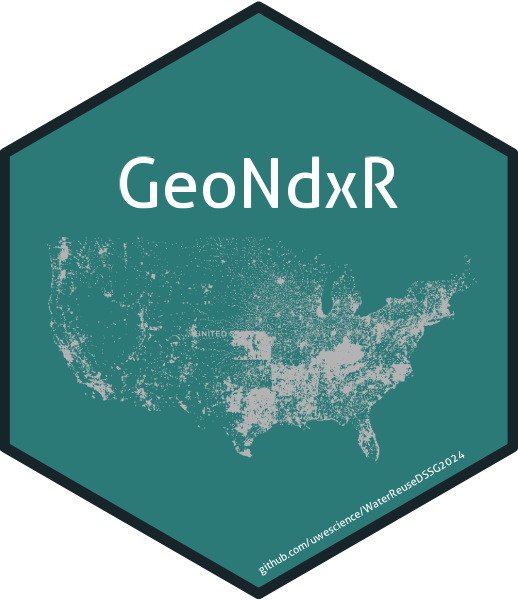

# Water Reuse and _GeoNdxr_ 

___
### Drivers-Based Water Reuse Potential project
**University of Washington DSSG summer 2024**

## Water Reuse Index
Our project aims to develop a framework for quantifying a community’s potential for water reuse based on various motivators—or drivers—to identify whether water reuse could be a local solution that merits further investigation. Combining that data into an informative index and presenting the results in a clear and digestible format is critical for supporting local decision-making. Using publicly available data across the US, our project looks at the correlation between drivers (both presence and intensity) and characterizes the benefits communities might find by exploring water reuse. For more information on drivers of water reuse, check out our project website [**here**](https://uwescience.github.io/WaterReuseDSSG2024/). 
___

## Create Your Own Index with _GeoNdxR_
Building an index can be helpful for not just water reuse, but various topics. We propose a general solution to the process of crosswalk shapefiles at different scales, reducing dimension, generating an index, and mapping it. We further believe there should be intuitive visualization tool which is digestible to subject matter non-experts. With the help of `GeoNdxR`, you can create a .html file, which your final audience can interact with. Final audience will be able to select indicators (out of the entire set chosen by the web creator) that they deem are important, and get their own index. Check out our sample html created for water reuse 👉[`here`](https://uwescience.github.io/WaterReuseDSSG2024/connecting-pieces/index.html)! 

## Get Started
Follow the instruction on the [`config_readme.txt`](https://github.com/uwescience/WaterReuseDSSG2024/blob/main/config-readme.txt) to set up your home path. All of our codes rely on relative path structure. 

If you want to create your own index, please go to [`Tutorial for GeoNdxR Index Creator`](https://github.com/uwescience/WaterReuseDSSG2024/blob/main/geo-ndxr/create_index_tutorial.md).

## Repository Structure
|**Features** | **Description**|
|-----------|------------|
|[`crosswalk`](https://github.com/uwescience/WaterReuseDSSG2024/blob/main/docs/tutorial/crosswalk.md)| This bundle of functions allows you to crosswalk data between multiple geospatial resolutions and appends additional ID columns relevant to U.S. Census.|
|[`create_index`](https://github.com/uwescience/WaterReuseDSSG2024/tree/main/code/create_index)|Features allow you to calculate index based on ToxiPi and PCA.|
|[`mapping`](https://github.com/uwescience/WaterReuseDSSG2024/tree/main/code/mapping)|Helper functions that map different resolutions of the U.S. map.|
|[`data_cleaning`](https://github.com/uwescience/WaterReuseDSSG2024/tree/main/code/data_cleaning)|Helper functions for checking unique IDs, and re-coding invalid Census-related identifiers.|

# [Contributors](https://escience.washington.edu/using-data-science/data-science-for-social-good/participants/)

**Fellows:**
- Jihyeon Bae 
- Nora Povejsil
- Mbye Sallah
- Daniel Vogler 

**Project Leads:**
- Miriam Hacker 
- Carolyn Hayek   

**Data Scientist:**
- Curtis Atkisson
